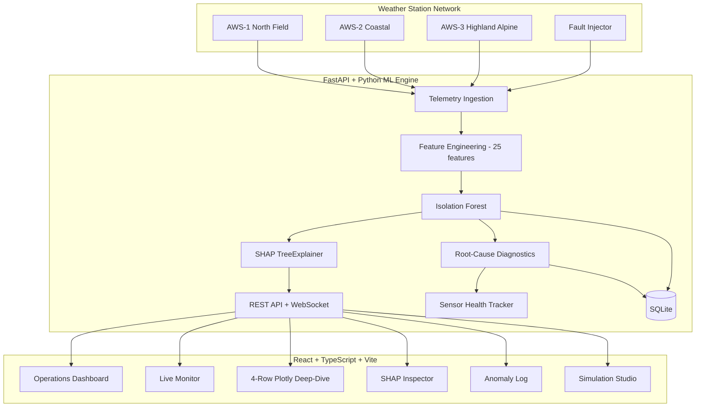
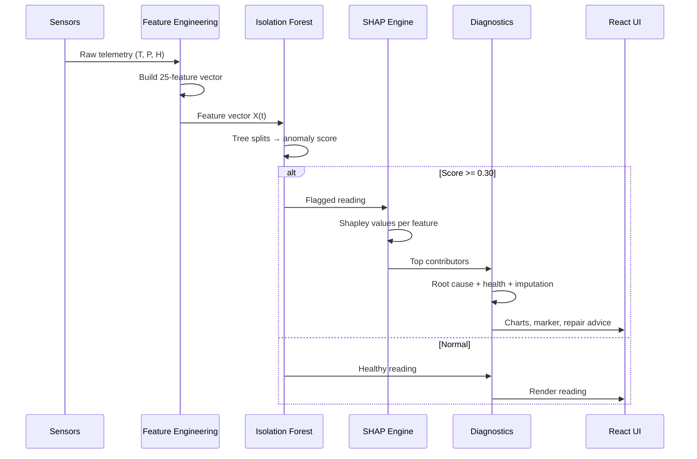

# SkyGuard AI

**Intelligent Automatic Weather Station (AWS) Anomaly Detection & Diagnostic Intelligence**

[](https://fastapi.tiangolo.com/)
[](https://www.python.org/)
[](https://reactjs.org/)
[](https://www.typescriptlang.org/)
[](https://vitejs.dev/)
[](https://tailwindcss.com/)
[](https://shap.readthedocs.io/)

> Smart India Hackathon (SIH) prototype. An end-to-end telemetry monitoring system that
> combines **Multivariate Machine Learning**, **Explainable AI (SHAP)**, **Rule-Based
> Root-Cause Diagnostics**, **Synchronized Plotly Telemetry**, and **Predictive Sensor
> Health Tracking**.

---

## Contents

1. [The Problem](#1-the-problem)
2. [How SkyGuard Solves It](#2-how-skyguard-solves-it)
3. [Measured Performance](#3-measured-performance)
4. [Architecture](#4-architecture)
5. [Features](#5-features)
6. [Project Structure](#6-project-structure)
7. [Tech Stack](#7-tech-stack)
8. [Running It Locally](#8-running-it-locally)
9. [Deploy to Render](#9-deploy-to-render)
10. [Configuration](#10-configuration)
11. [Testing](#11-testing)
12. [Authentication](#12-authentication)
13. [Further Documentation](#13-further-documentation)

---

## 1. The Problem

Weather stations report temperature, pressure, and humidity every few minutes from remote,
harsh environments. Over time, transducers lock up, calibration drifts, electromagnetic
surges spike readings, and radios drop packets. If corrupted data reaches forecast models
or disaster-response units, severe storms get missed or false evacuations get triggered.

Traditional networks rely on **static thresholds** (e.g. "flag above 45 °C"). Those fail
because:

- **Diurnal variation** — 32 °C is normal at 2 PM in summer, but a critical failure at 3 AM
  on an alpine station.
- **Thermodynamic coupling** — when air heats up, humidity naturally falls. Temperature
  surging while humidity climbs to 95% on a clear day violates atmospheric physics, but
  no per-sensor threshold catches it.
- **Slow calibration drift** — a transducer drifting +0.1 °C per day stays inside static
  limits for weeks while silently corrupting the climate archive.

### The five failure modes SkyGuard targets

| Failure mode | Physical cause | Real-world signature |
| :--- | :--- | :--- |
| **Transient spike** | EMI or power surge | `24.1 °C → 49.5 °C → 24.2 °C` in two intervals |
| **Frozen sensor** | Mechanical lockup or bus freeze | Humidity repeats `65.40%` for 4 hours |
| **Calibration drift** | Sensor degradation / wick drying | Pressure creeps +25 hPa above diurnal baseline over 3 days |
| **Communication gap** | Radio packet drop or battery brownout | Telemetry arrives empty / `NaN` for 45 minutes |
| **Multivariate outlier** | Micro-climate decoupling | Temperature and pressure diverge from the expected atmospheric tide |

---

## 2. How SkyGuard Solves It

```
  Telemetry (T/P/H)
        │
        ▼
  Feature Engineering ── 25 features: raw + physics-derived + rolling / rate-of-change
        │
        ▼
  Isolation Forest ──── unsupervised multivariate anomaly score
        │
        ├──▶ SHAP TreeExplainer ──▶ which feature drove the decision
        │
        ▼
  Evidence Fusion ───── 5 channels: ml / drift / flatline / missingness / rate-of-change
        │
        ├──▶ Root-Cause Diagnostic ──▶ physical failure mode + repair instructions
        ├──▶ Sensor Health Index ───── rolling 0-100% operational score
        └──▶ Corrected Value ───────── physics-informed imputation
        │
        ▼
  REST API + WebSocket ──▶ React dashboard, synchronized Plotly charts
```

Five independent detectors vote on every reading, so a failure that is invisible to a
statistical model (a flatlined sensor looks perfectly normal) is still caught by a
dedicated rule channel, and vice versa.

**Fusion weights** (production `skyguard-multivariate-v3`, threshold **0.30**):

| Channel | Weight | Catches |
| :--- | ---: | :--- |
| `ml` | 0.35 | Multivariate outliers (Isolation Forest) |
| `drift` | 0.05 | Slow calibration drift |
| `flat` | 0.20 | Frozen / stuck sensors |
| `miss` | 0.30 | Missing data and communication gaps |
| `roc` | 0.10 | Spikes and drops (rate of change) |

The model is trained **once** on a hash-pinned synthetic dataset and **frozen at inference** —
no online learning, no silent threshold changes. Full lineage in
[`docs/ML_DATA_PROVENANCE.md`](docs/ML_DATA_PROVENANCE.md).

---

## 3. Measured Performance

Production model evaluated on a 1,300-row injected-fault benchmark (seed 7), scored at its
persisted threshold of 0.30:

| Metric | Value |
| :--- | ---: |
| Precision | 0.7170 |
| Recall | 0.7917 |
| F1 | 0.7525 |
| ROC-AUC | 0.9046 |
| PR-AUC | 0.7289 |

Against the previous generation (`skyguard-multivariate-v2`, threshold 0.72):

| Metric | v2 (legacy) | v3 (production) |
| :--- | ---: | ---: |
| Precision | 0.9483 | 0.7170 |
| Recall | 0.3819 | **0.7917** |
| F1 | 0.5446 | **0.7525** |
| ROC-AUC | 0.7506 | **0.9046** |
| FROZEN recall | 0.0000 | **0.5000** |
| MISSING recall | 0.0000 | **0.7000** |

The trade is deliberate: v2 had high precision but **zero recall on frozen and missing
data** — the two failure modes that matter most for unattended stations. v3 more than
doubles recall overall while keeping ROC-AUC above 0.90.

Full breakdown and rejected alternatives: [`docs/ML_V3_TRAINING_REPORT.md`](docs/ML_V3_TRAINING_REPORT.md).

### Leakage controls

- Chronological train/validation split — never shuffled.
- Dedicated drift / flatline / missingness channels fitted on **train only**.
- The evaluation benchmark is a fixed injected frame, never used for tuning.
- Dataset pinned by SHA-256 in `data/sample_weather_v3.meta.json`.

---

## 4. Architecture



### Request lifecycle



---

## 5. Features

### Synchronized 4-row Plotly deep-dive

Four crosshair-linked time series with anomaly markers and preset time windows:

1. **Temperature (°C)** — thermal curve, red markers on flagged readings
2. **Barometric pressure (hPa)** — semidiurnal tide, aligned markers
3. **Relative humidity (%)** — psychrometric inverse curve
4. **Sensor health index (%)** — rolling 0-100% score, colour-graded

Three station profiles with distinct climatology: `AWS-1` inland semi-arid (wide diurnal
swing), `AWS-2` coastal maritime (high humidity, damped swing), `AWS-3` alpine
(2,450 m, 920 hPa baseline, freeze cycles).

### SHAP diagnostic inspector

- Per-reading feature attribution across all 25 features
- Horizontal bar chart of contributions that drove the decision
- Root-cause report: timestamp, station, confidence, observed readings, predicted failure
  mode, and recommended field procedure (*check RS485 bus*, *recalibrate psychrometric
  wick*, *inspect transducer grounding*)
- Anomaly selector for stepping through incidents

### Anomaly log

- Filter by type (`Spike`, `Frozen`, `Drift`, `Communication gap`, `Multivariate`)
- Adjustable sensitivity threshold
- One-click CSV export for audit
- `Inspect SHAP →` jumps straight to that timestamp in the inspector

### Live monitor

WebSocket stream with per-packet status badges (`NORMAL`, `ANOMALY`, `STALE`,
`UNAVAILABLE`) and a deterministic 35-reading demo episode replaying three real anomalies
at readings 13 / 23 / 33.

### Sensor health index

Rolling decay over recent anomaly rate:

| Tier | Range | Meaning |
| :--- | :--- | :--- |
| Optimal | >= 85% | Healthy hardware |
| Degraded | 60-85% | Early drift or intermittent dropouts |
| Critical | < 60% | High failure probability — dispatch maintenance |

### Spatial consensus

Cross-checks neighbouring stations to separate real weather from hardware failure. A
-25 hPa plunge across several stations within 50 km is a **genuine atmospheric event**;
the same drop at one isolated station is a **local sensor fault**.

### Simulation studio

Inject synthetic faults into any channel (spike, flatline, drift, packet dropout) and
immediately see detection latency, confidence, and SHAP response.

---

## 6. Project Structure

```
.
├── backend/
│   ├── app/
│   │   ├── main.py               # FastAPI entry point, routers, WebSocket
│   │   ├── config.py             # Env-driven configuration
│   │   ├── database.py           # SQLAlchemy engine / session
│   │   ├── models.py             # ORM models (Station, Anomaly, User, ...)
│   │   ├── schemas.py            # Pydantic request/response schemas
│   │   ├── services.py           # Core detection orchestrator
│   │   ├── detector.py           # Anomaly detection primitives
│   │   ├── features.py           # Feature engineering
│   │   ├── preprocessing.py      # Cleaning / imputation
│   │   ├── ingestion.py          # Telemetry loading
│   │   ├── simulator.py          # Fault injection engine
│   │   ├── auth_security.py      # WeatherLock auth (PBKDF2, sessions)
│   │   ├── ws.py                 # WebSocket connection manager
│   │   ├── routes/
│   │   │   ├── stations.py       # Station + prediction endpoints
│   │   │   ├── anomalies.py      # Anomaly log, timeline, evidence
│   │   │   ├── analytics.py      # Production analytics
│   │   │   ├── deep_dive.py      # Plotly charts, SHAP, simulation
│   │   │   └── auth.py           # Login / logout / session
│   │   └── ml/
│   │       ├── training.py       # Training pipeline, model load/save
│   │       ├── pipeline.py       # 5-channel evidence fusion
│   │       ├── multivariate.py   # Isolation Forest
│   │       ├── shap_explain.py   # SHAP attribution
│   │       ├── drift.py          # Drift channel
│   │       ├── flatline.py       # Frozen-sensor channel
│   │       ├── missingness.py    # Missing-data channel
│   │       ├── roc.py            # Rate-of-change channel
│   │       ├── severity.py       # Severity classification
│   │       ├── sensor_health.py  # Health index
│   │       ├── evidence.py       # Evidence assembly
│   │       ├── corrected_value.py# Physics-informed imputation
│   │       └── evaluation.py     # Evaluation harness
│   ├── models/                   # Persisted model artifacts
│   │   ├── skyguard_v1/          # legacy: model.pkl + metadata + schema
│   │   ├── skyguard_v2/          # legacy: model.pkl + metadata + schema
│   │   └── skyguard_v3/          # PRODUCTION: model.pkl + metadata + schema
│   ├── data_generator.py         # v1/v2 telemetry generator
│   ├── data_generator_v3.py      # v3 telemetry generator
│   ├── requirements.txt
│   └── tests/                    # test_demo, test_evidence, test_phase4,
│                                 # test_spatial, test_timeline
│
├── frontend/
│   ├── src/
│   │   ├── pages/                # 14 routed pages (see below)
│   │   ├── components/           # Layout, ui, icons, ExplanationPanel,
│   │   │                         # ModelVersionTag
│   │   ├── auth/AuthContext.tsx  # Session state
│   │   ├── hooks/useAnalytics.ts
│   │   ├── api.ts                # Typed API client
│   │   ├── types.ts              # TypeScript interfaces
│   │   ├── theme.tsx             # Design tokens
│   │   ├── attribution.ts        # SHAP attribution helpers
│   │   └── weatherEvents.ts      # Weather-event classification
│   ├── public/_redirects         # SPA routing (Netlify-style)
│   ├── package.json
│   ├── vite.config.ts            # Dev server + /api proxy to :8000
│   └── tailwind.config.js
│
├── weather_anomaly_detection/    # Standalone reference pipeline
│   ├── data_generator.py         # Climatological generator
│   ├── anomaly_injector.py       # Fault injection
│   ├── detector.py               # Isolation Forest detector
│   ├── explainer.py              # SHAP explainer
│   ├── evaluate.py               # Standalone evaluation script
│   └── requirements.txt
│
├── data/
│   ├── sample_weather.csv        # Live dataset (default DATA_FILE)
│   ├── sample_weather_v3.csv     # Training set (24 stations / 138,240 obs)
│   ├── sample_weather_v2.meta.json
│   └── sample_weather_v3.meta.json
│
├── ml/evaluation/run_phase3.py   # Read-only evaluation harness
├── docs/                         # ML reports, provenance, demo runbook
├── render.yaml                   # Render blueprint (frontend + backend)
├── Dockerfile
├── docker-compose.yml
└── clean_test_data.py            # Reset local DB test rows
```

### Frontend pages

`Dashboard` · `Live` · `Stations` · `StationDetail` · `Anomalies` · `AnomalyDetail` ·
`Analytics` · `XaiDeepDive` · `SensorHealth` · `Simulation` · `Model` · `Evaluation` ·
`Settings` · `Login`

---

## 7. Tech Stack

| Domain | Technology | Purpose |
| :--- | :--- | :--- |
| Backend | [FastAPI](https://fastapi.tiangolo.com/) + Uvicorn | Async REST + WebSocket |
| ML | [scikit-learn](https://scikit-learn.org/) | Isolation Forest, preprocessing |
| XAI | [SHAP](https://shap.readthedocs.io/) | TreeExplainer attribution |
| Numerics | [NumPy](https://numpy.org/) + [Pandas](https://pandas.pydata.org/) | Vectorization, rolling features |
| Viz (backend) | [Plotly](https://plotly.com/) | 4-row synchronized figures |
| Viz (frontend) | [Recharts](https://recharts.org/) + `plotly.js-dist-min` | Dashboard charts, deep-dive |
| Frontend | [React 18](https://reactjs.org/) + TypeScript | SPA |
| Build | [Vite](https://vitejs.dev/) | Dev server, bundling |
| Styling | [Tailwind CSS](https://tailwindcss.com/) | Dark glassmorphic UI |
| Database | [SQLAlchemy](https://www.sqlalchemy.org/) + SQLite | Event log, sessions |
| Maps | [Leaflet](https://leafletjs.com/) + `react-leaflet` | Station geography |

---

## 8. Running It Locally

Complete instructions for cloning (or forking) the repo and running the full website on
your own laptop.

### 8.1 What you need to install

You need **three** things. Nothing else — no database server, no Docker, no cloud account.

| # | Software | Version required | Why | Download |
| :-- | :--- | :--- | :--- | :--- |
| 1 | **Git** | 2.30+ | Clone / fork the repo | <https://git-scm.com/downloads> |
| 2 | **Python** | **3.11** (3.11.8 used in production) | Runs the FastAPI backend and the ML engine | <https://www.python.org/downloads/> |
| 3 | **Node.js** | **20.19+** or **22.12+** | Runs Vite / React frontend. Ships with npm | <https://nodejs.org/> |

> **Node version matters.** The frontend uses **Vite 8.3.0**, which refuses to run on
> anything older than Node `20.19.0` or `22.12.0`. If you already have Node 18 installed,
> upgrade it or the frontend build will fail.

**Optional**

| Software | Why |
| :--- | :--- |
| **Docker Desktop** | Only for the one-command Docker path in [section 9](#docker-alternative) |
| **VS Code** | Recommended editor — Python and ESLint extensions help |

**Check your versions.** All three commands should succeed:

```bash
git --version      # e.g. git version 2.49.0
python --version   # e.g. Python 3.11.8
node --version     # e.g. v22.19.0
npm --version      # e.g. 10.9.3
```

<details>
<summary>Windows users — avoid the most common setup mistakes</summary>

- During Python installation, **tick "Add python.exe to PATH"**. Without it `python` will
  not be found.
- If PowerShell blocks the venv activation script, run once:
  ```powershell
  Set-ExecutionPolicy -Scope CurrentUser -ExecutionPolicy RemoteSigned
  ```
- If you see a red `Activate.ps1 cannot be loaded` error, you can bypass activation
  entirely and just call the venv's executables directly:
  ```powershell
  backend\.venv\Scripts\python.exe -m pip install -r backend\requirements.txt
  backend\.venv\Scripts\python.exe -m uvicorn backend.app.main:app --port 8000
  ```
</details>

---

### 8.2 Get the code — Option A: Fork (recommended if you want to contribute)

A **fork** is your own copy on GitHub. Use this if you plan to change the code, fix bugs,
or submit to the project.

1. Open the SkyGuard repository on GitHub.
2. Click **Fork** (top right) → choose your account → **Create fork**.
3. Clone *your* fork:

```bash
git clone https://github.com/<your-username>/SkyGuard.git
cd SkyGuard
```

4. Keep your fork in sync with the original:

```bash
git remote add upstream https://github.com/<original-owner>/SkyGuard.git
git fetch upstream
git merge upstream/main
```

5. Work on a branch and push:

```bash
git checkout -b my-change
git add .
git commit -m "feat: describe your change"
git push origin my-change
```

Then open a Pull Request from your branch to the original repo.

---

### 8.3 Get the code — Option B: Clone (read-only use)

Use this if you just want to run the site locally.

```bash
git clone https://github.com/<original-owner>/SkyGuard.git
cd SkyGuard
```

> **Private repository?** You need a [Personal Access Token](https://github.com/settings/tokens)
> instead of your password:
> ```bash
> git clone https://<token>@github.com/<original-owner>/SkyGuard.git
> ```

### 8.4 No Git? Just download the ZIP

On GitHub: **Code → Download ZIP**, then `unzip` it and `cd` into the extracted folder.
You will not be able to push changes, but everything below works.

---

### 8.5 Step 1 — Set up the backend

You must be in the **repository root** (the folder containing `README.md`).

#### 1a. Create a virtual environment

A venv keeps the project's Python packages isolated from your system Python.

```bash
python -m venv backend/.venv
```

#### 1b. Activate it

**Linux / macOS (bash):**
```bash
source backend/.venv/bin/activate
```

**Windows (PowerShell):**
```powershell
backend\.venv\Scripts\Activate.ps1
```

**Windows (CMD):**
```cmd
backend\.venv\Scripts\activate.bat
```

Your prompt should now show `(.venv)`. macOS/Linux users can use `source` or `.` instead.

#### 1c. Install Python dependencies

```bash
pip install --upgrade pip
pip install -r backend/requirements.txt
```

This installs FastAPI, scikit-learn, SHAP, PyOD, pandas, NumPy, Plotly and friends —
roughly **500 MB**, and it can take **3-5 minutes** on a first run (SHAP pulls in `numba`
and `llvmlite`).

#### 1d. Start the backend

```bash
# Run from the REPOSITORY ROOT
uvicorn backend.app.main:app --reload --port 8000
```

> **Important:** run this from the repository root, using the full
> `backend.app.main:app` path. The app uses package-relative imports, so
> `cd backend && uvicorn app.main:app` **will fail**.

Wait for startup. It ingests the sample dataset and loads the trained model, which takes
**10-30 seconds** on first run. You should see:

```
INFO:     Started server process [xxxx]
INFO:     Waiting for application startup.
INFO:     Application startup complete.
INFO:     Uvicorn running on http://0.0.0.0:8000
```

#### 1e. Verify the backend is alive

Open <http://localhost:8000/api/health> in your browser. Expected:

```json
{"status":"online","system":"SKYGUARD AI","model_trained":true}
```

You can also browse the interactive API docs at <http://localhost:8000/docs>.

---

### 8.6 Step 2 — Set up the frontend

Open a **second terminal** (keep the backend running in the first).

```bash
cd frontend
npm ci
npm run dev
```

`npm ci` installs exactly the versions in `package-lock.json` — use it rather than
`npm install` so you get a reproducible match. First run takes **1-3 minutes**.

Expected output:

```
  VITE v8.3.0  ready in 412 ms

  ➜  Local:   http://localhost:5173/
```

Open **<http://localhost:5173>**.

No environment variables are needed locally — the Vite dev server proxies `/api` and
`/api/live` to `http://127.0.0.1:8000` (see `frontend/vite.config.ts`). The backend must
be running or the pages will render empty.

---

### 8.7 Step 3 — Log in

Every data page is behind the WeatherLock screen.

```
username: skyguard
pattern:  thermometer → droplet → chart → zap
PIN:      739214
```

Click the four weather icons in that order, then enter the PIN.

These defaults are seeded automatically on first startup and defined in
`backend/app/auth_security.py`. Change them there before deploying anywhere public.
See [Authentication](#12-authentication).

---

### 8.8 Quick reference — the two commands you actually need

Once set up, every time you work on the project you only need:

```bash
# Terminal 1 (repository root) — leave running
uvicorn backend.app.main:app --reload --port 8000

# Terminal 2 — leave running
cd frontend && npm run dev
```

Then open <http://localhost:5173>.

---

### 8.9 Troubleshooting

| Problem | Cause | Fix |
| :--- | :--- | :--- |
| `python: command not found` | Python not installed or not on PATH | Reinstall with **"Add to PATH"** ticked |
| `No module named backend.app` | Started uvicorn from inside `backend/` | `cd` to the repository root and use `backend.app.main:app` |
| `ModuleNotFoundError: No module named 'app'` | venv not activated | Activate it (8.5b) or use the venv's python directly |
| Vite: "requires Node 20.19+ or 22.12+" | Node too old | Upgrade Node, or install [nvm](https://github.com/nvm-sh/nvm) and `nvm install 22` |
| Pages render but all data is empty | Backend not running, or not on port 8000 | Check <http://localhost:8000/api/health> |
| `401 Unauthorized` in the console | Session expired (30-min idle timeout) | Log in again |
| Stuck on the login screen after 3 tries | 30-second lockout after failed attempts | Wait 30 s, then retry |
| Plots do not appear on Deep Dive | Plotly bundle blocked | Hard-refresh (`Ctrl+Shift+R`) and check the browser console |
| `npm ci` fails with a lockfile mismatch | `package-lock.json` out of sync | Use `npm install` once, then commit the updated lockfile |
| Port 8000 or 5173 already in use | Another process holds it | `--port 8001` (and update `vite.config.ts`), or free the port |
| Out of memory during `pip install` | SHAP + scikit-learn are large | Close other apps; use a virtual env on a drive with 2 GB+ free |

---

### 8.10 Stopping and resetting

**Stop the servers:** press `Ctrl+C` in each terminal.

**Reset all local data** (deletes the SQLite database; it is recreated on next start):

```bash
rm backend/skyguard.db            # Linux / macOS
del backend\skyguard.db           # Windows CMD
```

Or use the included helper, which also clears simulation rows:

```bash
python clean_test_data.py
```

---

## 9. Deploy to Render

`render.yaml` provisions both services as a single Blueprint.

| Service | Type | URL |
| :--- | :--- | :--- |
| `skyguard-backend` | Web service (Python) | `https://skyguard-backend.onrender.com` |
| `skyguard-frontend` | Static site | `https://skyguard-frontend.onrender.com` |

### Steps

1. Push this repository to a **private** GitHub repo.
2. In Render: **New → Blueprint** → select the repo. Render reads `render.yaml` and creates
   both services.
3. Wait for the backend to finish `pip install -r backend/requirements.txt` and boot.
4. Open the frontend URL and log in.

### Already configured in `render.yaml`

| Variable | Service | Value |
| :--- | :--- | :--- |
| `PYTHON_VERSION` | backend | `3.11.8` |
| `CORS_ORIGINS` | backend | `*` |
| `DATA_DIR` | backend | `./data` |
| `VITE_API_URL` | frontend | `https://skyguard-backend.onrender.com` |
| `VITE_WS_URL` | frontend | `wss://skyguard-backend.onrender.com/api/live` |

`VITE_API_URL` **must include the `https://` scheme** — `frontend/src/api.ts` uses the raw
value as the fetch base, and a bare hostname is treated as a relative URL.

### Free-tier limitations

| Limitation | Impact | Mitigation |
| :--- | :--- | :--- |
| 512 MB RAM | Loads 3 model artifacts (~22 MB) plus shap/scikit-learn at import | Use a paid instance if the backend OOMs on boot |
| Ephemeral filesystem | SQLite is wiped on every deploy | Demo data and the user account are re-seeded on startup |
| 15-minute idle spin-down | First request waits ~50 s while waking | Expected; the WebSocket also drops on sleep |

### Docker alternative

```bash
docker compose up --build      # http://localhost:8000
```

The image builds the frontend, then serves it from the FastAPI process.

---

## 10. Configuration

All backend settings are environment variables with working defaults
(`backend/app/config.py`):

| Variable | Default | Purpose |
| :--- | :--- | :--- |
| `DATABASE_URL` | `sqlite:///backend/skyguard.db` | SQLAlchemy connection |
| `DATA_DIR` | `<repo>/data` | Dataset directory |
| `DATA_FILE` | `sample_weather.csv` | Dataset filename |
| `MODEL_DIR` | `backend/models` | Model artifact directory |
| `CORS_ORIGINS` | `localhost:5173,localhost:3000` | Comma-separated allowed origins |
| `STREAM_INTERVAL_SEC` | `2.0` | WebSocket stream cadence |
| `ENABLE_CORRECTED_VALUES` | `true` | Emit imputed corrections |
| `NORMAL_CONTAMINATION` | `0.05` | Expected anomaly rate in "normal" data |
| `CALIBRATION_METHOD` | `none` | Kept off until validated |

Frontend variables (build-time, must be set before `npm run build`):

| Variable | Purpose |
| :--- | :--- |
| `VITE_API_URL` | Backend REST base URL |
| `VITE_WS_URL` | Backend WebSocket URL |

Locally both can be omitted — Vite proxies `/api` to port 8000.

---

## 11. Testing

```bash
# Backend unit tests (from repository root)
python -m unittest discover backend/tests

# Frontend
cd frontend
npm test            # vitest
npx tsc -b          # type check
npm run build       # production bundle
```

CI runs both on every push and pull request to `main`
(`.github/workflows/deploy.yml`).

---

## 12. Authentication

Every data endpoint is guarded by **WeatherLock**, a single-account visual challenge
(`backend/app/auth_security.py`, `backend/app/routes/auth.py`):

- Username + a sequence of 4 weather icons + a 6-digit PIN
- PIN and icon sequence stored as salted **PBKDF2-SHA256** hashes (200,000 iterations) —
  never plaintext
- Session tokens are opaque random strings held **in memory only** (not persisted, not
  JWTs)
- 30-minute idle expiry
- Lockout for 30 s after 3 consecutive failed attempts

The default account is seeded on first startup. Sessions live in memory, so **all sessions
are invalidated on every backend restart** — expected on Render's ephemeral instances.

> The default PIN is committed in source. Keep the repository private, or change
> `DEFAULT_PATTERN` / `DEFAULT_PIN` in `backend/app/auth_security.py` before deploying.

---

## 13. Further Documentation

| Document | Contents |
| :--- | :--- |
| [`docs/ML_V3_TRAINING_REPORT.md`](docs/ML_V3_TRAINING_REPORT.md) | v3 training: dataset, split, search, metrics, rejected configs |
| [`docs/ML_DATA_PROVENANCE.md`](docs/ML_DATA_PROVENANCE.md) | Dataset lineage, hashes, model/dataset version map |
| [`docs/ML_AUDIT.md`](docs/ML_AUDIT.md) | Independent audit of the detector; v2 failure analysis |
| [`docs/ML_Performance_Improvement_Report.md`](docs/ML_Performance_Improvement_Report.md) | v2 → v3 campaign results |
| [`docs/SIH_Demo_Runbook.md`](docs/SIH_Demo_Runbook.md) | Step-by-step demo script |
| [`ml/evaluation/run_phase3.py`](ml/evaluation/run_phase3.py) | Read-only evaluation harness |

---

Built for the **Smart India Hackathon**. Designed to protect meteorological
infrastructure, improve early-warning systems, and preserve data fidelity across
automated weather sensor networks.
