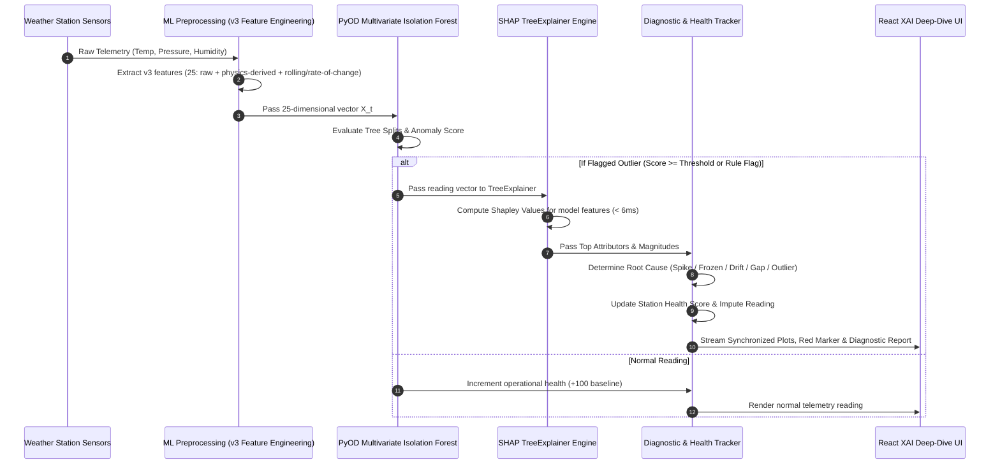

# 🌦️ SkyGuard AI: Intelligent Automatic Weather Station (AWS) Anomaly Detection & Diagnostic Intelligence

[](https://fastapi.tiangolo.com/)
[](https://www.python.org/)
[](https://reactjs.org/)
[](https://www.typescriptlang.org/)
[](https://vitejs.dev/)
[](https://tailwindcss.com/)
[](https://plotly.com/)
[](https://pyod.readthedocs.io/)
[](https://shap.readthedocs.io/)

> **Smart India Hackathon (SIH) Prototype Edition**  
> An end-to-end, safety-critical telemetry monitoring system combining **Multivariate Machine Learning (PyOD Isolation Forest)**, **Explainable AI (SHAP TreeExplainer)**, **Rule-Based Root-Cause Diagnostics**, **4-Row Synchronized Plotly Meteorological Telemetry**, and **Predictive Sensor Health Tracking**.

> **ML production model (current):** `skyguard-multivariate-v3`, trained once on the
> hash-pinned synthetic `sample_weather_v3` dataset (24 stations / 138,240 obs /
> 25 features) and frozen at inference; decision threshold **0.30**, five-channel
> evidence fusion (ml 0.35 / drift 0.05 / flat 0.20 / miss 0.30 / roc 0.10),
> uncalibrated. v1 and v2 remain persisted as **legacy** artifacts. Model/dataset
> lineage lives in `docs/ML_DATA_PROVENANCE.md`; the demo script in
> `docs/SIH_Demo_Runbook.md`.

---

## 📖 Table of Contents
1. [🌟 What is SkyGuard AI?](#-what-is-skyguard-ai)
2. [🛑 The Problem: Why Weather Sensors Fail](#-the-problem-why-weather-sensors-fail)
3. [💡 How SkyGuard AI Solves It](#-how-skyguard-ai-solves-it)
4. [🏛️ System Architecture](#️-system-architecture)
5. [🔄 End-to-End Workflow](#-end-to-end-workflow)
6. [✨ Key Features & Modules](#-key-features--modules)
   - [1. Synchronized 4-Row Plotly Telemetry Deep-Dive](#1-synchronized-4-row-plotly-telemetry-deep-dive)
   - [2. High-Speed SHAP TreeExplainer Diagnostic Inspector](#2-high-speed-shap-treeexplainer-diagnostic-inspector)
   - [3. Flagged Telemetry Anomalies Log & 1-Click CSV Export](#3-flagged-telemetry-anomalies-log--1-click-csv-export)
   - [4. Real-Time Live Monitor & WebSocket Telemetry Streaming](#4-real-time-live-monitor--websocket-telemetry-streaming)
   - [5. Dynamic Rolling Sensor Health Index (0 - 100%)](#5-dynamic-rolling-sensor-health-index-0---100)
   - [6. Spatial Consensus: Severe Weather vs. Sensor Fault](#6-spatial-consensus-severe-weather-vs-sensor-fault)
   - [7. Fault Injection & Simulation Studio](#7-fault-injection--simulation-studio)
7. [📊 9-Feature Temporal Trend Engineering](#-9-feature-temporal-trend-engineering) *(legacy / research deep-dive)*
8. [📂 Project Structure](#-project-structure)
9. [🛠️ Tech Stack](#️-tech-stack)
10. [🚀 Quick Start Guide](#-quick-start-guide)
11. [🧪 Automated Testing & Verification](#-automated-testing--verification)
12. [🌿 Git & Version Control](#-git--version-control)

---

## 🌟 What is SkyGuard AI?

Automatic Weather Stations (AWS) deployed in remote, harsh environments—from mountain summits to coastal shorelines—continuously report critical measurements of **Temperature**, **Barometric Pressure**, and **Relative Humidity** at high frequencies (5-minute intervals).

Over time, physical exposure causes transducers to lock up, calibration to drift, electromagnetic surges to spike readings, or telemetry radios to drop packets. If downstream weather prediction models or disaster response units ingest corrupted data, severe storms can be missed or false emergency evacuations can be triggered.

**SkyGuard AI acts as an intelligent, autonomous sentinel that:**
1. **Monitors** multivariate weather telemetry 24/7 across station networks.
2. **Detects** complex single-point, multi-point, and cross-channel anomalies in real time.
3. **Explains** *why* data was flagged using game-theoretic Explainable AI (**SHAP TreeExplainer**).
4. **Diagnoses** the physical failure mode (**Spike**, **Frozen sensor**, **Slow drift**, **Communication gap**, or **Multivariate correlation breakdown**).
5. **Recommends** precise engineering repair actions for ground technicians.
6. **Repairs** corrupted readings via physics-informed imputation to prevent forecast pipeline failure.

---

## 🛑 The Problem: Why Weather Sensors Fail

Traditional automated weather networks rely on **static thresholds** (e.g., flag if temperature $> 45^\circ\text{C}$). 

### Why Static Thresholds Fail:
- **Diurnal Variations**: $32^\circ\text{C}$ is normal at 2:00 PM on a summer afternoon, but $32^\circ\text{C}$ at 3:00 AM on an alpine station is a critical sensor failure.
- **Thermodynamic Coupling**: When air heats up, relative humidity naturally drops. If temperature surges while humidity simultaneously rises to $95\%$ on a clear day, physical atmospheric laws are violated. Static checks cannot catch cross-sensor correlation collapses.
- **Slow Calibration Drift**: An aging transducer drifting $+0.1^\circ\text{C}$ per day will stay within static thresholds for weeks while silently contaminating meteorological archives.

### The 5 Meteorological Sensor Failure Modes:
| Failure Mode | Physical Cause | Real-World Example |
| :--- | :--- | :--- |
| **⚡ Transient Spike** | Electromagnetic interference (EMI) or power surge | Instant jump: $24.1^\circ\text{C} \rightarrow 49.5^\circ\text{C} \rightarrow 24.2^\circ\text{C}$ |
| **❄️ Frozen Sensor** | Transducer mechanical lockup or I2C bus freeze | Humidity repeats exact reading $65.40\%$ for 4 consecutive hours |
| **📈 Calibration Drift** | Photodiode degradation or psychrometric wick drying | Pressure creeps $+25\text{ hPa}$ above diurnal baseline over 3 days |
| **📡 Communication Gap** | 4G/LoRaWAN radio packet drop or battery brownout | Telemetry arrives as empty / `NaN` readings for 45 minutes |
| **🌪️ Multivariate Outlier** | Micro-climate sensor decoupling | Temperature and pressure diverge from expected atmospheric tide |

---

## 💡 How SkyGuard AI Solves It

> **Production detector (current):** `skyguard-multivariate-v3` — **25 features**,
> decision threshold **0.30**, five-channel evidence fusion (ml 0.35 / drift 0.05 /
> flat 0.20 / miss 0.30 / roc 0.10), trained once on the hash-pinned
> `sample_weather_v3` dataset and frozen at inference. The diagrams and lists below
> describe this end-to-end flow. Some boxes still carry the "9-feature" wording of
> the original prototype pipeline; that 9-feature scheme is **legacy / research
> material** and is documented as such in the deep-dive section below.

```
┌────────────────────────────────┐     ┌────────────────────────────────┐     ┌────────────────────────────────┐
│   9-Feature Temporal Trend     │ ──> │   PyOD Multivariate IForest    │ ──> │   SHAP TreeExplainer (XAI)     │
│   Engineering (Rolling & Dev)  │     │   Ensemble Anomaly Scoring     │     │   Sub-10ms Feature Attribution │
└────────────────────────────────┘     └────────────────────────────────┘     └────────────────────────────────┘
                 │                                                                             │
                 ▼                                                                             ▼
┌────────────────────────────────┐     ┌────────────────────────────────┐     ┌────────────────────────────────┐
│   Rule-Based Root-Cause        │ ──> │   Dynamic Sensor Health        │ ──> │   Actionable Maintenance       │
│   Diagnostic Engine            │     │   Index Tracking (0 - 100%)    │     │   Directions for Engineers     │
└────────────────────────────────┘     └────────────────────────────────┘     └────────────────────────────────┘
```

1. **Multivariate Isolation Forest (scikit-learn / PyOD)**: Evaluates the full 25-feature v3 vector — raw temperature, pressure, and humidity plus generic derived physics and rolling/rate-of-change trend features — simultaneously within an ensemble of isolation trees.
2. **25-Feature v3 Feature Space (current production)**: Combines raw readings, physics-derived quantities, and rolling/rate-of-change trend features that isolate slow sensor drifts raw checks miss. *(The original prototype used a 9-dimensional temporal feature space — raw readings augmented with 20-step moving averages and rolling deviations; it is retained below as legacy/research deep-dive material.)*
3. **High-Speed SHAP Engine**: Mathematically computes Shapley value contributions across all model features (25 in v3) in $< 6\text{ ms}$.
4. **Synchronized Plotly Subplots**: 4-row synchronized timeseries with crosshair tooltips, multi-parameter zooming, and time slice presets (**7-Day Reference**, **14-Day**, **Full 30-Day**).
5. **Physics-Informed Diagnostics**: Maps anomalous mathematical signatures into human-readable mechanical root causes with actionable field procedures.

---

## 🏛️ System Architecture

```mermaid
graph TB
    subgraph Weather Station Network
        AWS1[AWS-1: North Field Station]
        AWS2[AWS-2: Coastal Station]
        AWS3[AWS-3: Highland Alpine Station]
        SIM[Simulation & Fault Injector]
    end

    subgraph Backend Core [FastAPI + Python ML Engine]
        ING[Telemetry Ingestion & Preprocessing]
        FE[Feature Engineering - v3 (25 features)]
        
        subgraph ML & Diagnostic Intelligence
            PYOD[PyOD Multivariate Isolation Forest]
            SHAP_ENG[SHAP TreeExplainer Attribution Engine]
            DIAG[Physics-Informed Root-Cause Classifier]
            HEALTH[Rolling Sensor Health Tracker]
            IMPUTE[Diurnal Imputation Engine]
        end
        
        API[RESTful Endpoints & WebSocket Streamer]
        DB[(SQLite Persistence Layer)]
    end

    subgraph Frontend Application [React + TypeScript + Vite + Tailwind]
        DASH[1. Operations Command Dashboard]
        LIVE[2. Real-Time Live Monitor]
        PLOTLY_DEEP[3. 4-Row Synchronized Plotly Subplots]
        XAI_PANEL[4. Interactive SHAP Diagnostic Inspector]
        LOG[5. Flagged Anomalies Log with CSV Export]
        SIM_UI[6. Fault Testing & Simulation Studio]
    end

    AWS1 --> ING
    AWS2 --> ING
    AWS3 --> ING
    SIM --> ING

    ING --> FE
    FE --> PYOD
    PYOD --> SHAP_ENG
    PYOD --> DIAG
    DIAG --> HEALTH
    DIAG --> IMPUTE

    PYOD --> DB
    DIAG --> DB
    SHAP_ENG --> API
    API --> DASH
    API --> LIVE
    API --> PLOTLY_DEEP
    API --> XAI_PANEL
    API --> LOG
    API --> SIM_UI
```

---

## 🔄 End-to-End Workflow



---

## ✨ Key Features & Modules

### 1. 🔬 Synchronized 4-Row Plotly Telemetry Deep-Dive
- **Synchronized Subplots**:
  1. **Temperature Telemetry (°C)**: Thermal curve with red scatter markers on flagged anomalies.
  2. **Barometric Pressure Telemetry (hPa)**: Semidiurnal tidal pressure curve with aligned anomaly markers.
  3. **Relative Humidity Telemetry (%)**: Psychrometric inverse curve with anomaly markers.
  4. **Rolling Sensor Health Index (%)**: Continuous 0–100% operational health score with emerald gradient fill.
- **Unified Crosshairs**: Hovering anywhere displays synchronized readings, physical units, and anomaly diagnoses simultaneously across all 4 rows.
- **Quick Preset Time Slicing**:
  - **7-Day Slice (Reference)**: Optimal view displaying individual 5-minute oscillations and isolated spikes.
  - **14 Days**: Medium-term synoptic weather trend view.
  - **Full 30 Days**: Complete monthly telemetry lifecycle.
- **Station Climatology Profiles**:
  - `AWS-1 (North Field Station)`: Inland continental semi-arid station with wide diurnal thermal swings.
  - `AWS-2 (Coastal Station)`: Maritime tropical station with high humidity ($78\%$) and marine layer damping.
  - `AWS-3 (Highland Alpine Station)`: Alpine environment ($2,450\text{ m}$ elevation, $920\text{ hPa}$ baseline, sub-zero freeze cycles).

---

### 2. 🔍 High-Speed SHAP TreeExplainer Diagnostic Inspector
- **Instantaneous Attribution (< 6 ms)**: Pre-calibrated background tree sample and per-point caching eliminate calculation delays and prevent interface freezes.
- **9-Dimensional Horizontal Bar Chart**:
  - 🔴 **Primary Driver**: Sensor channel responsible for the largest contribution to the outlier decision.
  - 🟠 **Trend Deviation**: Local deviation from rolling mean ($\Delta T_{20}$, $\Delta P_{20}$, $\Delta H_{20}$).
  - 🔵 **Baseline Metric**: Ambient rolling average channel.
- **Diagnostic Root-Cause Report**:
  - Event Timestamp, Station ID, Model Confidence, and PyOD Anomaly Score.
  - Observed Telemetry Channel Readings (Temp, Pressure, Humidity).
  - Predicted Failure Mode and **Recommended Maintenance Procedures** (e.g., *Check RS485 communication bus*, *Recalibrate psychrometric wick*, *Inspect transducer grounding*).
- **Interactive Anomaly Selector**: Dropdown selector and **Next Anomaly →** button for rapid stepping through flagged incidents.

---

### 3. 📋 Flagged Telemetry Anomalies Log & 1-Click CSV Export
- Filter by anomaly type (`Spike`, `Frozen`, `Drift`, `Communication gap`, `Multivariate Outlier`).
- Real-time sensitivity threshold adjustment ($0\% - 100\%$).
- Ground-truth validation toggle.
- **1-Click CSV Export**: Download complete incident logs formatted for compliance audits.
- **Direct Navigation**: `Inspect SHAP →` button on any row jumps directly to that timestamp in the SHAP inspector.

---

### 4. ⚡ Real-Time Live Monitor & WebSocket Telemetry Streaming
- WebSocket connection streaming live 5-minute interval telemetry packets.
- Visual station status badges: `NORMAL`, `ANOMALY`, `STALE`, `UNAVAILABLE`.
- Visual cues and audio alerts upon detecting hazardous sensor telemetry.

---

### 5. 🛡️ Dynamic Rolling Sensor Health Index (0 - 100%)
- Rolling exponential decay tracking anomaly rate over recent operational windows.
- Health tier classification:
  - 🟢 **Optimal ($\ge 85\%$)**: Healthy sensor hardware.
  - 🟡 **Degraded ($60\% - 85\%$)**: Early signs of calibration drift or intermittent dropouts.
  - 🔴 **Critical ($< 60\%$)**: High failure probability; physical maintenance dispatch recommended.

---

### 6. 🌐 Spatial Consensus: Severe Weather vs. Sensor Fault
- **Network-Wide Cross-Validation**:
  - If a sudden pressure plunge of $-25\text{ hPa}$ occurs across multiple neighboring stations within a $50\text{ km}$ radius, SkyGuard AI identifies a **genuine atmospheric event (e.g., severe cyclonic front or squall line)**.
  - If only a single isolated station drops by $-25\text{ hPa}$ while all neighboring stations report steady barometric pressure, SkyGuard AI flags a **local hardware sensor failure**.

---

### 7. 🧪 Fault Injection & Simulation Studio
- Interactively inject synthetic faults to test detection algorithms:
  - Channels: Temperature, Barometric Pressure, Relative Humidity.
  - Anomaly Types: Transient Spike, Frozen Flatline, Calibration Drift, Telemetry Packet Dropout.
- Instantly verify model detection latency, confidence, and SHAP attribution response.

---

## 📊 9-Feature Temporal Trend Engineering

> **Legacy / research deep-dive — NOT the current production detector.** This section
> documents the original 9-feature prototype feature space (raw T/P/H + 20-step moving
> averages and deviations). The current production detector is `skyguard-multivariate-v3`
> with **25 features**, threshold **0.30**, and five-channel fusion (ml 0.35 / drift 0.05 /
> flat 0.20 / miss 0.30 / roc 0.10) — see *ML production model (current)* near the top.
> This material is preserved for evaluation lineage and deep-dive reference only.

$$\mathbf{X}_t = \Big[ T_t, P_t, H_t, \bar{T}_{20}, \Delta T_{20}, \bar{P}_{20}, \Delta P_{20}, \bar{H}_{20}, \Delta H_{20} \Big]$$

| Feature | Mathematical Formula | Physical Meaning |
| :--- | :--- | :--- |
| `temperature` | Raw $T_t$ | Ambient thermal sensor reading (°C) |
| `pressure` | Raw $P_t$ | Barometric air pressure reading (hPa) |
| `humidity` | Raw $H_t$ | Relative humidity reading (%) |
| `temperature_rolling_mean_20` | $\bar{T}_{20} = \frac{1}{20}\sum_{i=0}^{19} T_{t-i}$ | 100-minute moving average baseline |
| `temperature_deviation_20` | $\Delta T_{20} = T_t - \bar{T}_{20}$ | Local thermal rate-of-change deviation |
| `pressure_rolling_mean_20` | $\bar{P}_{20} = \frac{1}{20}\sum_{i=0}^{19} P_{t-i}$ | 100-minute moving average baseline |
| `pressure_deviation_20` | $\Delta P_{20} = P_t - \bar{P}_{20}$ | Local barometric tidal deviation |
| `humidity_rolling_mean_20` | $\bar{H}_{20} = \frac{1}{20}\sum_{i=0}^{19} H_{t-i}$ | 100-minute moving average baseline |
| `humidity_deviation_20` | $\Delta H_{20} = H_t - \bar{H}_{20}$ | Local psychrometric deviation |

---

## 📂 Project Structure

```
SkyGuard/
├── .gitignore                      # Git ignore configuration
├── README.md                       # Master project documentation
├── backend/                        # FastAPI Python backend
│   ├── app/
│   │   ├── main.py                 # FastAPI application entry point
│   │   ├── ml/
│   │   │   └── pyod_detector.py    # v3 25-feature detector pipeline (9-dim prototype kept as legacy)
│   │   ├── routes/
│   │   │   ├── deep_dive.py        # Synchronized Plotly chart & SHAP endpoints
│   │   │   ├── telemetry.py        # Real-time ingestion & historical API
│   │   │   ├── anomalies.py        # Anomaly logging & filtering endpoints
│   │   │   └── simulation.py       # Fault injection studio endpoints
│   │   └── models/                 # SQLAlchemy ORM models & database schemas
│   ├── requirements.txt            # Python dependencies
│   └── tests/                      # Automated unit and integration test suite
├── frontend/                       # React 18 + TypeScript + Vite frontend
│   ├── src/
│   │   ├── pages/
│   │   │   ├── XaiDeepDive.tsx     # Plotly subplots & SHAP Inspector page
│   │   │   ├── Dashboard.tsx       # Fleet overview command center
│   │   │   ├── LiveMonitor.tsx     # Real-time telemetry streaming monitor
│   │   │   └── Simulation.tsx      # Fault injection laboratory
│   │   ├── components/             # Reusable UI cards, tables, charts, navigation
│   │   ├── api.ts                  # Typed API client
│   │   └── types.ts                # TypeScript interfaces and response schemas
│   ├── package.json                # Frontend dependencies & scripts
│   └── vite.config.ts              # Vite configuration
├── weather_anomaly_detection/      # Standalone reference ML pipeline & Streamlit app
│   ├── data_generator.py           # Climatological weather telemetry generator
│   ├── anomaly_injector.py         # Fault injection engine
│   ├── detector.py                 # PyOD Isolation Forest detector
│   ├── explainer.py                # SHAP TreeExplainer implementation
│   └── dashboard.py                # Reference Streamlit dashboard
├── data/                           # Sample meteorological CSV datasets
└── ml/                             # Evaluation benchmarks & metrics scripts
```

---

## 🛠️ Tech Stack

| Domain | Technology | Purpose |
| :--- | :--- | :--- |
| **Backend Framework** | [FastAPI](https://fastapi.tiangolo.com/) | Asynchronous high-throughput REST and WebSocket APIs |
| **Machine Learning** | [PyOD](https://pyod.readthedocs.io/) | Multivariate Isolation Forest outlier detection |
| **Explainable AI** | [SHAP](https://shap.readthedocs.io/) | Game-theoretic TreeExplainer Shapley attribution |
| **Numerical Computing** | [NumPy](https://numpy.org/) & [Pandas](https://pandas.pydata.org/) | Telemetry vectorization and rolling feature extraction |
| **Data Visualization** | [Plotly](https://plotly.com/) & [Recharts](https://recharts.org/) | Interactive 4-row subplots and responsive charts |
| **Frontend Framework** | [React 18](https://reactjs.org/) + [TypeScript](https://www.typescriptlang.org/) | Type-safe single-page application |
| **Build Tool** | [Vite](https://vitejs.dev/) | Sub-second hot module reloading and optimized bundling |
| **Styling** | [Tailwind CSS](https://tailwindcss.com/) | Dark-mode glassmorphic interface with micro-animations |
| **Database** | [SQLAlchemy](https://www.sqlalchemy.org/) + SQLite | Relational event log and metadata persistence |

---

## 🚀 Quick Start Guide

### Prerequisites
- **Python $\ge$ 3.10**
- **Node.js $\ge$ 18.0** and **npm**
- **Git**

---

### Step 1: Clone the Repository
```bash
git clone https://github.com/AshXtreme/SkyGuard.git
cd SkyGuard
```

---

### Step 2: Set Up Backend
```bash
# Navigate to backend directory
cd backend

# Create and activate a Python virtual environment
python3 -m venv .venv
source .venv/bin/activate       # On Windows: .venv\Scripts\activate

# Install Python dependencies
pip install -r requirements.txt

# Start the FastAPI server
uvicorn app.main:app --reload --port 8000
```
- Interactive API Documentation (Swagger UI): `http://localhost:8000/docs`
- Alternative API Documentation (ReDoc): `http://localhost:8000/redoc`

---

### Step 3: Set Up Frontend
```bash
# Open a new terminal and navigate to frontend directory
cd frontend

# Install dependencies
npm install

# Start the Vite development server
npm run dev
```
- Open your browser and navigate to: `http://localhost:5173`

---

## 🧪 Automated Testing & Verification

### Running Backend Unit Tests
```bash
# From backend directory with virtual environment activated
python -m unittest discover tests
```
*Executes tests covering data validation, PyOD Isolation Forest anomaly scoring, SHAP explainability attribution, sensor health degradation, and root-cause classification.*

### Running Frontend Tests & Type Checking
```bash
# From frontend directory
npx tsc -b          # Type-check TypeScript codebase
npm run build       # Build production bundle
```

---

## 🌿 Git & Version Control

To commit and push updates to the remote repository:

```bash
# Check repository status
git status

# Stage all files (respects .gitignore)
git add .

# Commit changes with descriptive message
git commit -m "feat: complete SkyGuard AI with synchronized Plotly telemetry and sub-10ms SHAP inspector"

# Push to GitHub
git push -u origin main
```

---

## 👥 Authors & Acknowledgments
Built with ❤️ for the **Smart India Hackathon (SIH)**.  
Designed to safeguard national meteorological infrastructure, improve early warning systems, and ensure data fidelity across automated weather sensor networks.
---

## 🗝️ Logging In (WeatherLock)

The dashboard is protected by a **WeatherLock** visual lock. On first load you are
asked for three things:

| Field | Value |
| --- | --- |
| Username | `skyguard` |
| Icon pattern | Thermometer 🌡️ → Droplet 💧 → Chart 📊 → Zap ⚡ (in that order) |
| PIN | `739214` |

Click the four icons in the order shown, type the 6-digit PIN, then sign in.
Three wrong attempts trigger a 30-second lockout.

> The credentials above are demo defaults and are intentionally public. Replace
> them in `backend/app/auth_security.py` before any real deployment.

---

## 🗝️ Deploying to Render

A `render.yaml` at the repository root provisions both services as a Blueprint:

| Service | Type | Notes |
| --- | --- | --- |
| `skyguard-backend` | Web service (Python) | `uvicorn backend.app.main:app`, health check at `/api/health` |
| `skyguard-frontend` | Static site (React + Vite) | builds `frontend/dist`, SPA rewrite to `index.html` |

Steps:

1. Push the repository to GitHub.
2. In Render choose **New → Blueprint**, pick the repo, branch `main`, and accept
   the two services Render lists.
3. The frontend needs the backend URL, which is already set in `render.yaml` as
   `VITE_API_URL` and `VITE_WS_URL`.

**Free-tier limits worth knowing:** the backend sleeps after 15 minutes idle and
takes roughly a minute to wake, so the first request after a pause will hang
briefly. `render.yaml` pins `NODE_VERSION=22` because Vite 8 will not build on
older Node.

---

## 🗝️ Troubleshooting

| Symptom | Cause |
| --- | --- |
| Login page shows no icons | Backend unreachable; the icon grid is fetched from `/api/auth/pattern` |
| `{"detail":"Not Found"}` on the backend URL | Expected — there is no `/` route. Use `/api/health` |
| Frontend builds but pages 404 | Ensure `staticPublishPath` is `frontend/dist` and the build writes there |
| Requests hang for ~1 minute after idling | Free-tier cold start, not an error |
