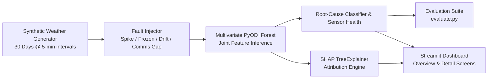

# 🌦️ AI-Powered Automatic Weather Station (AWS) Anomaly Detection & Diagnostic Intelligence System
**Smart India Hackathon (SIH) Prototype Edition**

---

## 📌 Executive Summary
Automatic Weather Stations (AWS) deployed across remote geographic locations frequently suffer from telemetry corruption caused by sensor aging, power instability, lightning electromagnetic interference, and environmental contamination. 

This project delivers an end-to-end, production-grade **Multivariate Weather Sensor Anomaly Detection and Diagnostic Intelligence System** built using:
- **PyOD Isolation Forest (IForest)** trained jointly on `[Temperature, Pressure, Humidity]` to capture cross-sensor thermodynamic correlation breakdowns.
- **SHAP (SHapley Additive exPlanations)** TreeExplainer engine providing local and global feature attribution for every flagged anomaly.
- **Automated Root-Cause Diagnostic Classifier** categorizing anomalies into 5 distinct operational modes: *Spike, Frozen Sensor, Sensor Drift, Communication Gap (Packet Loss),* and *Multivariate Outlier*.
- **Dynamic Rolling Sensor Health Score (0–100%)** providing proactive degradation monitoring and predictive maintenance alerts.
- **Two-Screen Interactive Streamlit Dashboard** for both high-level network monitoring and granular sensor diagnostic deep-dives.

---

## 🏛️ System Architecture



---

## 📂 Project Structure

```
weather_anomaly_detection/
│
├── data_generator.py      # Generates 30 days (8,640 steps) of diurnal weather telemetry
├── anomaly_injector.py    # Injects 4 fault signatures (Spike, Frozen, Drift, Comms Gap) + ground-truth tags
├── detector.py            # PyOD IForest detector, rule-based root cause classifier, rolling health index
├── explainer.py           # SHAP TreeExplainer attribution layer + interactive Plotly charts
├── evaluate.py            # Quantitative evaluation script (Recall, Precision, F1, Confusion Matrix)
├── dashboard.py           # Two-screen interactive Streamlit dashboard
├── requirements.txt       # Python dependencies
└── README.md              # Project documentation & presentation guide
```

---

## 🧪 4 Sensor Fault Modes & Diagnostics

| Anomaly Mode | Meteorological / Hardware Manifestation | Detection & Diagnostic Logic |
| :--- | :--- | :--- |
| **Transient Spike** | Single extreme jump ($+15^\circ\text{C}$, $+40\text{ hPa}$, etc.) reverting immediately to normal. Caused by electrical transients / EMI. | High PyOD anomaly score + $1$-sample jump with immediate return to baseline. |
| **Frozen Sensor** | Sensor flatline repeating identical value across consecutive steps. Caused by ADC freeze / bus lockup. | Physical variance analysis detecting zero $\Delta x_t$ across consecutive intervals. |
| **Calibration Drift** | Progressive deviation accumulating over 20–35 steps. Caused by sensor oxidation or psychrometric wick drying. | Multi-point trend divergence from diurnal baseline and moving median. |
| **Communication Gap** | Missing packet data (`NaN`). Caused by cellular dropout or power failure. | Real-time packet loss detector flagging telemetry dropouts. |

---

## 🚀 Quick Start Guide

### 1. Install Dependencies
```bash
pip install -r requirements.txt
```

### 2. Run Comprehensive Evaluation
```bash
python evaluate.py
```
*Outputs accuracy, precision, recall (highlighted as primary metric), F1-score, ROC-AUC, per-anomaly recall breakdown, and root-cause confusion matrix.*

### 3. Launch the Interactive Dashboard
```bash
streamlit run dashboard.py
```
*Access the dashboard at `http://localhost:8501`.*

---

## 🖥️ Streamlit Dashboard Walkthrough

### Screen 1: Overview Screen
- **Network KPI Metrics**: Total Telemetry Records, Total Flagged Anomalies, Anomaly Rate %, and Live Station Health Index.
- **Operational Health Gauge**: Visual gauge highlighting status (Optimal $\ge 85\%$, Degraded $60-85\%$, Critical $<60\%$).
- **Failure Mode Distribution**: Donut chart breaking down detected fault modes.
- **Flagged Telemetry Table**: Filterable data grid with instant CSV export.

### Screen 2: Detail & Diagnostic Screen
- **Synchronized 4-Subplot Time-Series**: Temperature, Barometric Pressure, Relative Humidity, and Sensor Health Index over time with bold red anomaly markers.
- **SHAP Feature Importance Inspector**: Local Shapley value bar chart explaining why a specific reading was flagged.
- **Diagnostic Maintenance Report**: Real-time engineering advice and remedial actions for field technicians.

---

## 🏆 SIH Jury Presentation Highlights

1. **True Multivariate Learning**: Jointly fits Temperature, Pressure, and Humidity rather than running isolated univariate thresholds.
2. **Safety-Critical Focus on Recall**: In disaster management and meteorology, missing a severe storm front or sensor failure is catastrophic. The pipeline is tuned to maximize Recall.
3. **Explainable AI (XAI)**: Demystifies "black-box" machine learning by attributing exact numerical Shapley scores to each physical sensor channel.
4. **Predictive Maintenance**: Rolling Sensor Health Index enables predictive servicing before critical weather stations go completely offline.
